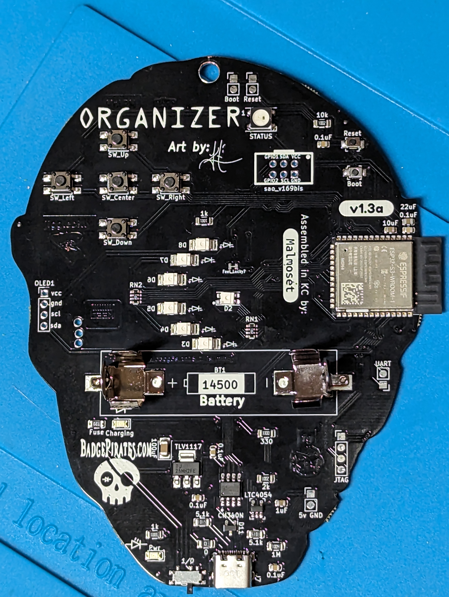

# OzSecBadgeTesting

Welcome to the OzSecBadgeTesting repo.
The code for the 2023 OzSec badges is hosted here.
You can use this code to understand how the badge runs with the stock firmware.

|  |  |
|:--:|:--:|
| Front | Back |

## Hardware
Arduino
ESP32-S3-WROOM-1

## Required Arduino libraries:
- esp32 v2.0.11 (Espressif Systems)
- FastLED v3.6.0 (Daniel Garcia) (for RGB LED on the back of the badge)
- ThingsBoard v0.11.1

## Usage
- Install the [Arduino IDE](https://www.arduino.cc/en/software) - We used version 2.2.1 when building
- Install the [required arduino libraries](./README.md#required-arduino-libraries)
- Open the `ozsecbadge/ozsecbadge.ino` file in Arduino IDE
- Plug the board into your computer via the USB-C plug using a cable that supports data transfer
- Select the board and port.
  - Select the ESP32S3 Dev Module
  - [Arduino Support: Select board and port](https://support.arduino.cc/hc/en-us/articles/4406856349970-Select-board-and-port-in-Arduino-IDE)
- Power on the board while holding the `Boot` button on the back. You only need to hold the button while powering on.
- Using the Arudino IDE `Sketch` menu, upload the code to the board using `Sketch -> Upload (Ctrl+U)`.
- Once the upload is complete, reset the board by pressing the `Reset` button on the back of the board (next to the `Boot` button).
- Open the serial connection using the `Tools -> Serial Monitor` menu item.
  - Make sure the baud rate is set to 115200.

## Tips
- Pinch the USB-C port between your fingers while you plug or unplug the USB-C cable. This reduces the risk of breaking off the USB-C port from the board.
- Be careful when toggling the power switch on the board as the switch can break.
